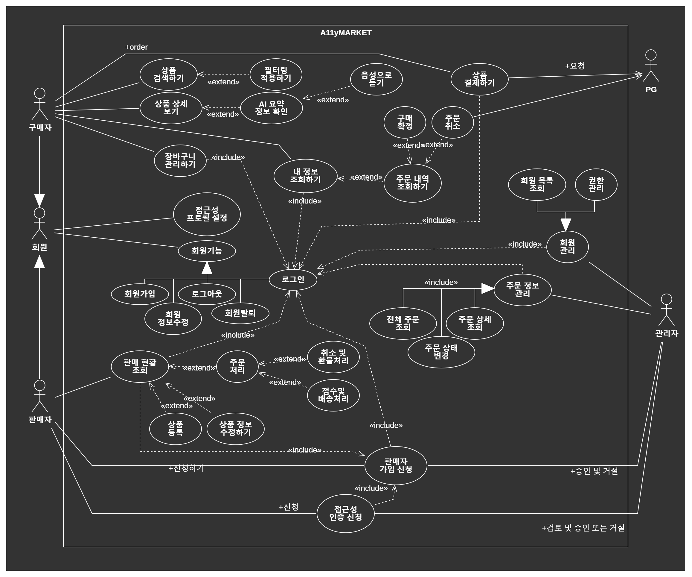
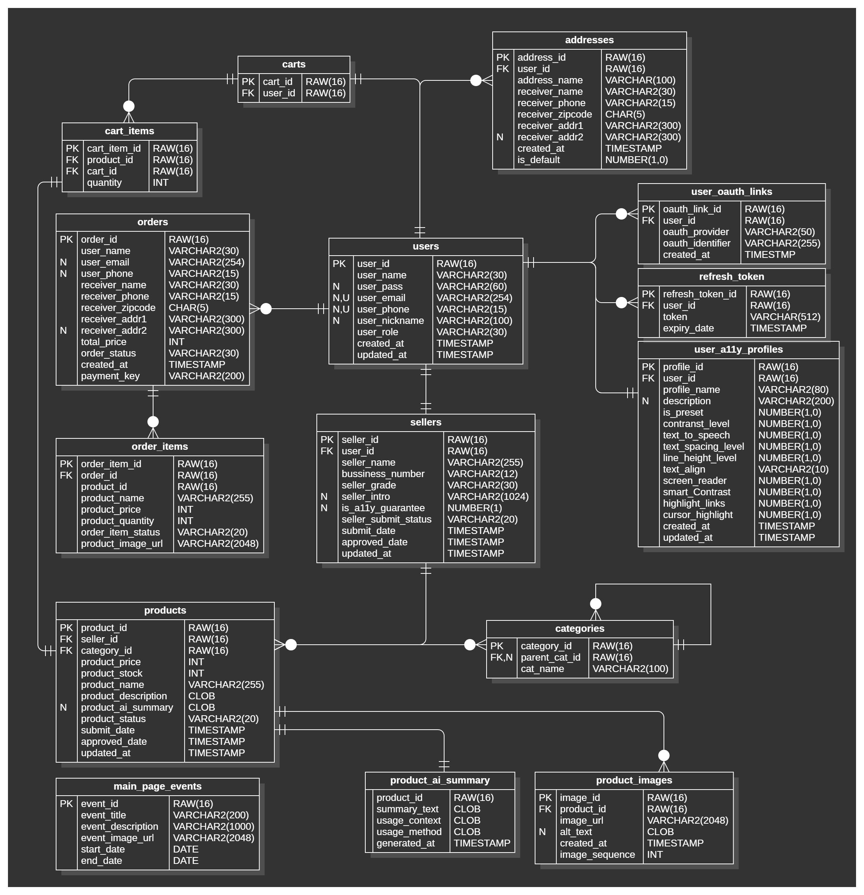
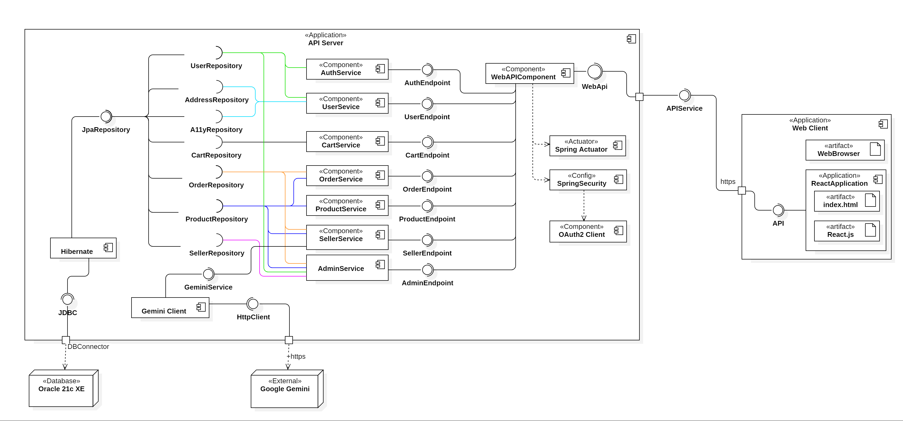
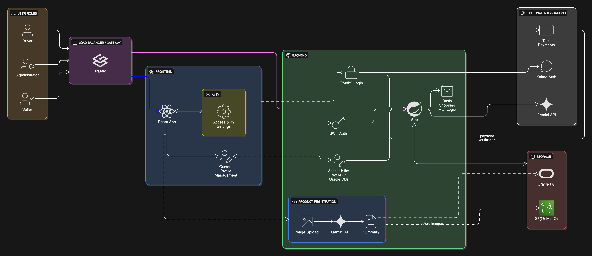
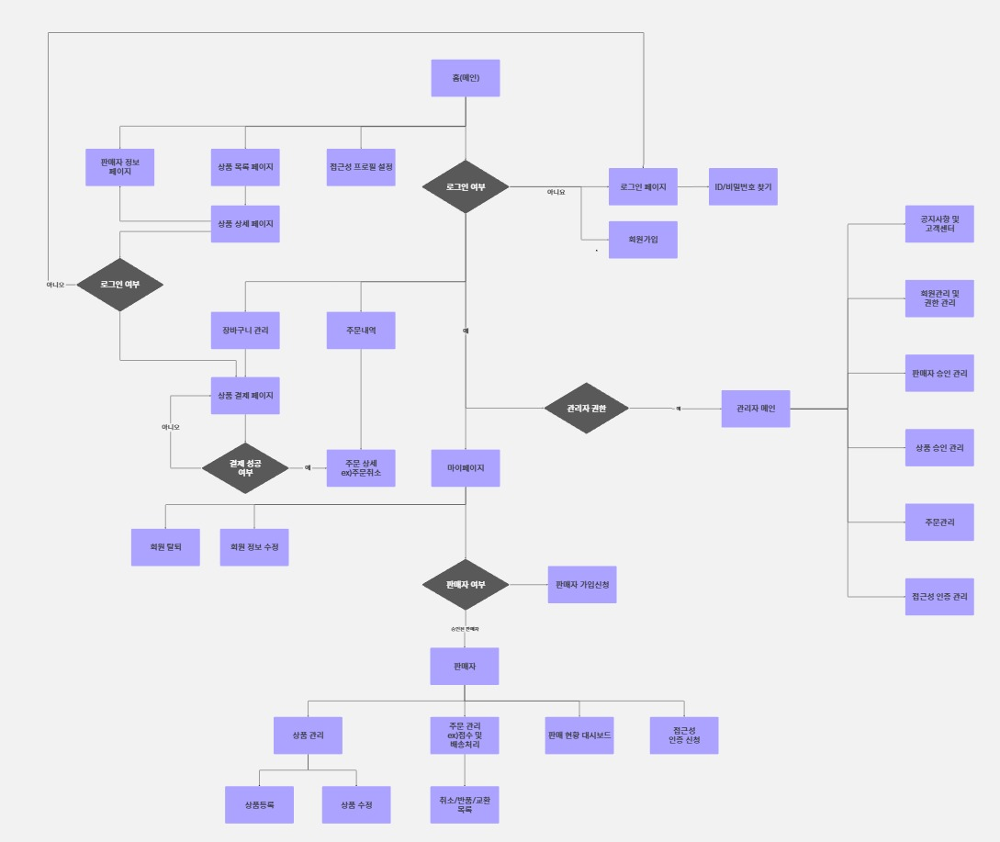
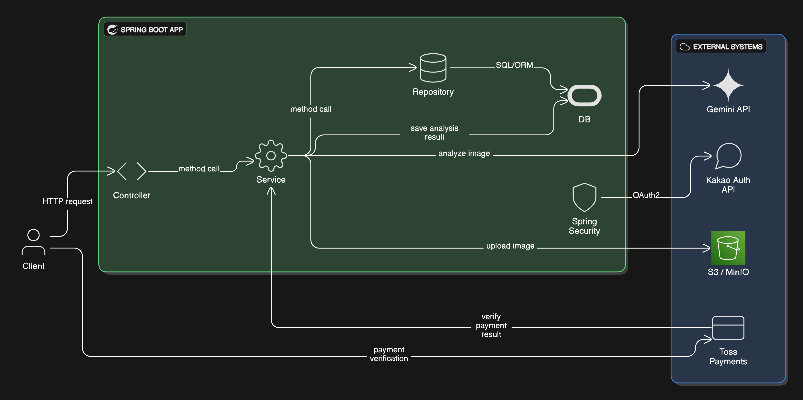
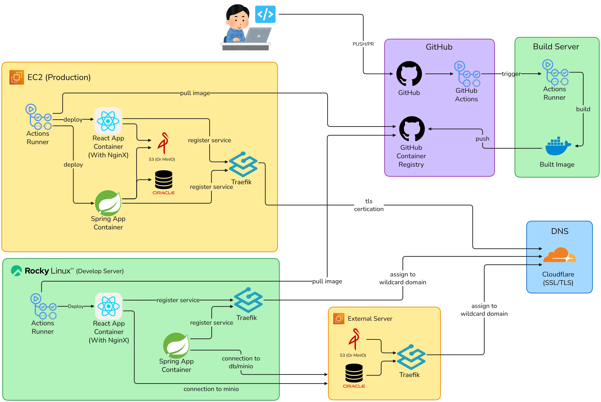

# Diagrams

## 1. Use-Case Diagram

## 2. E-R Diagram

## 3. Component Diagram

## 4. Hybrid View

## 5. System Architecture

## 6. UI FlowChart

## 7. Backend Structrues

## 8. CI/CD Pipeline

